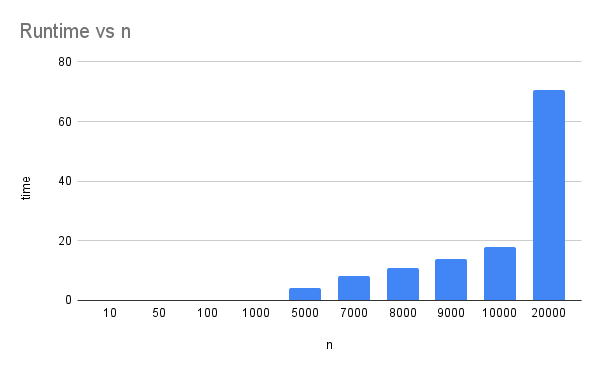

# Programming Assignment 3
- Name: Joshua Labasbas
- UFID: 37663960

# Usage
From root run 
```
python src/input-gen.py [length of alphabet] [length of strings] [input file name]
```
for example:
```
python src/input-gen.py 26 50 out.in
```


Then to run the HVLCS solver run:
```
python src/main.py [input file name]
```
Using the same example:
```
python src/main.py out.in
```

All generated input files are put into data, and main.py will look for the given filename
in the data folder

# Question 1


# Question 2
The base case is, for every element not on the diagonal for dp_table(where i and j are equal) the best value is zero.

The recursive case breaks down into two cases, dp_table[i][j] is equal to:
1. dp_table[i-1][j-1] + V(A[i]) if A[i] == B[j]
2. max(dp_table[i-1][j], dp_table[i][j-1]) if A[i]!=B[i]

(1) means that the characters are common and we can append the value to the maximum longest substring, otherwise
(2) is the case, and we take the max of either of the last two characters.

# Question 3

1. dp_table[len(A), len(B)] = 0 # All cells initialized to zero
2. for every cell in A
    1. For every cell in B
        if last A character == last B character:
            1. Add current charater value to cell in dp_table
        else:
            1. Current cell in dp_table is the max of the values of the last two characters of A and B
3. Initialize empty result string
4. from the bottom right cell
    1. If the last two characters of A and B are equal
        1. Add the current character to the result string
        2. Move back 1 index both A and B
    2. else if the last character of A is greater than the last character of B
        1. Move back 1 character in A
    3. else
        1. Move back 1 character in B
5. return the length of the result string

The time complexity of this algorithm is O(n * m) where n and m are the lengths of A and B respectively. This is the same as the
algorithm implemented of main to find HVLCS and we just take the length at the end which is O(1), the HVLCS is O(n * m), which
dominates O(1)

